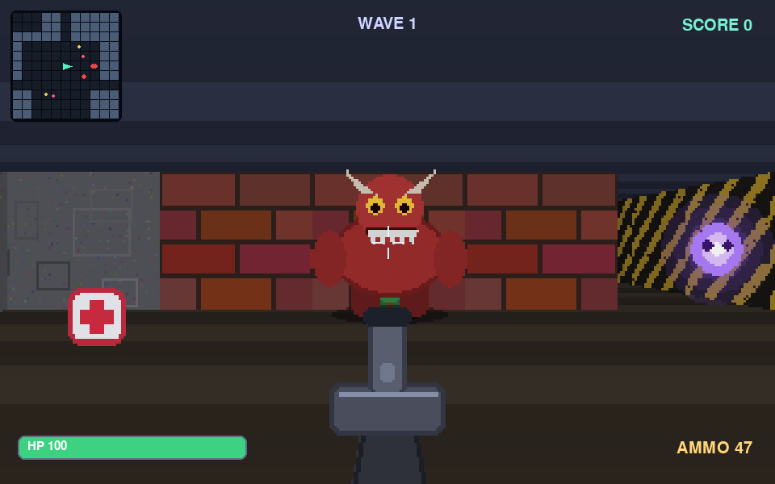

# Dungeon Strike 3D

用 **Python + pygame** 从零实现的**第一人称 3D 光线投射射击游戏**。没有引擎、没有外部素材：墙体贴图、敌人精灵、音效全部程序生成。



## 下载

| 平台 | 文件 | 说明 |
| --- | --- | --- |
| **Windows** | [**DungeonStrike3D.exe**](https://github.com/donutboy09/Small_game/releases/latest/download/DungeonStrike3D.exe) | 双击运行，单文件免安装 |
| **macOS** | [**DungeonStrike3D-macos.zip**](https://github.com/donutboy09/Small_game/releases/latest/download/DungeonStrike3D-macos.zip) | 解压后双击 `DungeonStrike3D.app` |

全部版本见 [Releases](https://github.com/donutboy09/Small_game/releases)。

> 未做代码签名：Windows 首次运行若被 SmartScreen 拦，点「更多信息 → 仍要运行」；macOS 若提示无法打开，右键 →「打开」，或执行 `xattr -dr com.apple.quarantine DungeonStrike3D.app`。

## 操作

| 按键 | 功能 |
| --- | --- |
| `W` `A` `S` `D` | 移动 |
| 鼠标 | 转视角 |
| 鼠标左键 / `空格` | 射击 |
| `←` `→` | 左右转向 |
| `P` / `ESC` | 暂停（释放鼠标） |
| `M` | 静音 |
| `Enter` | 开始游戏 |
| `R` | 死亡后重开 |

## 玩法

清光每一波敌人即可进入下一波，波次越高敌人越多越强。捡红色医疗包回血、黄色弹药箱补子弹。屏幕左上角是小地图，红色点为敌人。每波都会重新生成一座地牢。

敌人有三种：

- **Grunt** 绿色，均衡
- **Brute** 红色，血厚伤害高
- **Wisp** 紫色，飘浮、速度快

## 从源码运行

```bash
python3 -m pip install pygame
python3 main.py
```

## 自行打包

```bash
python3 -m pip install pyinstaller

# Windows
pyinstaller --onefile --windowed --name DungeonStrike3D main.py

# macOS
pyinstaller --windowed --name DungeonStrike3D main.py
```

也可以推送 `v*` 标签，或在 GitHub 的 **Actions** 页面手动触发 `Build executables` 工作流，云端会同时产出 Windows 和 macOS 两个包。

## 项目结构

```
main.py      游戏循环、状态机、HUD、武器
engine.py    光线投射渲染器（贴图墙 + 深度排序精灵）
world.py     程序化地牢生成
entities.py  玩家 / 敌人 / 拾取物 / 粒子
textures.py  程序生成贴图与精灵
audio.py     合成音效
settings.py  参数常量
```

## 技术要点

- DDA 光线投射，逐列贴图绘制，距离阴影与雾
- 精灵按深度排序，用 z-buffer 逐列裁剪实现正确遮挡
- 低分辨率 320×200 内部渲染 + 3 倍整数放大，复古像素风
- 敌人 AI：视线 + 听觉索敌、朝玩家寻路、撞墙滑行
- 全部音效由正弦/方波/锯齿波与噪声实时合成
